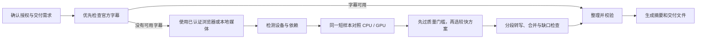

# Authorized Live Transcript Workflow

A reusable Codex Skill for turning an authorized live-stream replay or supplied audio/video into a traceable transcript package.

## 产品介绍

`authorized-live-transcript` 是一套可复用的直播回放转写工作流。它先检查可用字幕与用户当前已认证的浏览器会话，再使用本地语音识别处理获准获取的媒体或用户提供的音视频文件，最后生成逐字稿、摘要和可复核的交付物。

它适合需要整理课程、讲座、培训和线上直播回放的用户。它不会绕过平台权限；能否读取回放，取决于用户账号当前可访问的页面、实际可用的浏览器控制方式或用户提供的本地媒体文件。

### 主要能力

- **优先复用字幕**：先检查官方字幕；没有可用字幕时，再使用已认证浏览器中的可播放媒体，或处理用户提供的本地文件。
- **按设备选择转写方案**：识别 CPU、内存、GPU 和运行库；用同一段短音频比较候选方案。先检查转写质量，再在质量合格的方案中比较速度。只有设备资源允许且已验证时，才并行使用 CPU 与 GPU。
- **保留过程证据**：按时间与分段记录识别结果、缺失片段、修复和不确定词；机器输出不会冒称人工校对。
- **生成多种成果**：可按需提供带时间码逐字稿、清理后的阅读稿、章节摘要、核心要点、行动项、专有名词清单，以及 Markdown / Word 文档。

### 工作流程



## 使用方法

### 1. 安装 Skill

下载或克隆本仓库，把这些文件放入 Codex Skills 目录下名为 `authorized-live-transcript` 的文件夹，并确保入口文件位于 `authorized-live-transcript/SKILL.md`。详细工具、官方依赖下载位置和兼容提示见 [SKILL.md](SKILL.md)。

### 2. 发起任务

在 Codex 中调用 `$authorized-live-transcript`，并提供回放链接或本地音视频文件、访问授权情况、需要的输出格式和专有名词。

**回放链接示例**

```text
使用 $authorized-live-transcript 处理这个我有权访问的直播回放：
回放链接：<粘贴链接>
输出：带时间码逐字稿、清理稿、章节摘要、核心要点、行动项和专有名词清单
格式：Markdown；如可用，再附 Word 文档
```

**本地文件示例**

```text
使用 $authorized-live-transcript 转写这个本地文件：<文件路径>
请提供带时间码逐字稿、章节摘要、核心要点、行动项和专有名词清单。
```

如果用户已登录的浏览器页面尚未打开，先打开并登录后再运行；不要提供密码、Cookie、Authorization 头或签名链接。

### 3. 查看结果

最终报告会说明实际使用的来源路径、设备与模型、CPU/GPU 是否真正参与、分段完整性、速度对照范围、质量检查状态，以及已生成的文件。未听音复核的内容会明确标注为机器转写。

## 工具与依赖

浏览器采集路径需要已登录且可控的 Chrome 会话及可用浏览器控制方式。转写路径使用 Python、faster-whisper / CTranslate2、PyAV 和 NumPy；GPU 加速还要求驱动及 CUDA/cuDNN 与实际安装版本兼容。Word 输出可选用 `python-docx` 和本地文档渲染器。

各工具官方下载地址、安装方式和版本兼容说明集中列在 [SKILL.md 的官方下载位置](SKILL.md#official-download-locations)。不要仅凭检测到 GPU 或安装了运行库就认定 GPU 转写可用；必须完成真实样本推理验证。

## 仓库内容

- [SKILL.md](SKILL.md)：工具准备、安装链接和逐步执行要求。
- [架构与验收参考](references/architecture-and-acceptance.md)：组件边界、性能对照、分段溯源及验收规则。
- [agents/openai.yaml](agents/openai.yaml)：Skill 元数据。

