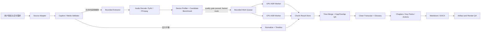

# 架构与验收参考

本参考把一次可运行的长回放转写流程抽象成能替换浏览器、平台、GPU 和文档工具的流水线。它是实现指南，不代表各平台都开放相同接口。

## 架构边界



### 可替换组件

| 组件 | 稳定接口 | 当前任务中的一种实现 | 可替换项 |
|---|---|---|---|
| Source Adapter | 返回授权来源、字幕/manifest 线索与实际可见时长 | 已登录 Chrome + Playwright Extension | Chrome Computer Use 或另一已认证浏览器控制工具 |
| Extractor | 有界时间窗/连续分段，返回带时间偏移的媒体字节 | Node.js 在已认证 browser context 中读取 HLS 分段 | 平台官方导出；无浏览器访问时用用户提供文件 |
| Decoder | 浏览器取得的 MPEG-TS/容器 → 单声道 16 kHz float waveform | PyAV + NumPy 从混合 A/V 容器 demux 音频 | FFmpeg / 已兼容容器解码器 |
| Scheduler | 有界队列，任务索引、时间偏移、结果回执 | Python queue + GPU/CPU workers | async queue 或工作进程池 |
| Recognizer | `transcribe(audio, language, options) -> segments + metadata` | faster-whisper / CTranslate2 | 其他本地或获准 ASR 服务；必须保留来源/设备回执 |
| Result Store | append-only chunk records and status | JSONL + status JSON | SQLite 或具备等价追溯性的存储 |
| QA / Delivery | transcript records + duration → reviewed artifacts | Python merger, Markdown, python-docx | 其他可打开、可渲染的文档工具 |

浏览器只负责在用户当前已认证会话中访问其可见资源；它不是绕过权限的下载器。已验证的直播链路没有可用官方字幕，也没有独立音轨下载，而是读取该会话正在播放的 HLS playlist，再分组取回含音视频的 MPEG-TS segment；本地 PyAV demux 音轨并转成 16 kHz 单声道浮点波形供 ASR 使用。Segment 以小组在内存中处理，浏览器并未把完整视频或单独音频文件落盘。Extractor、ASR worker 和交付器不应该接触浏览器 cookies、Authorization 或签名凭据。通过 loopback 传输的是当前媒体片段字节，应只在处理期间存在于内存；服务端默认禁用请求体和敏感 URL 日志。

## 数据契约建议

每个输入块保留：

```json
{
  "job_id": "task-scoped-random-id",
  "chunk_index": 12,
  "start_seconds": 720.0,
  "source_duration_seconds": 60.0,
  "source_kind": "authorized-browser-hls",
  "payload_sha256": "optional-ephemeral-integrity-hash",
  "state": "accepted|completed|failed",
  "worker_device": "cuda|cpu|subtitle",
  "model": "model-and-version",
  "segments": [
    {"start_seconds": 720.5, "end_seconds": 724.1, "text": "..."}
  ]
}
```

实际 Skill 使用中，不要把签名 URL、cookies、用户身份、Authorization 头、浏览器令牌放进此契约。来源路径可写成类型标签，不写带访问凭据的 URL。`payload_sha256` 仅在确实需要识别重复媒体块时使用；哈希不是匿名化凭据。

Job manifest 至少记录：媒体名/用户给定标签、来源类型、观测时长、目标语言、是否保存原始媒体、模型设置、硬件设备回执、预期分段/分块数、已接收/已完成/失败计数、输出文件和未解决问题。存在多条可运行路线时，还记录硬件画像、候选配置、同一音频样本标识/时长、预热与重复次数、各路线 ASR-only 与端到端用时、参考稿/质量指标、通过门槛的路线、最终选择及回退原因。媒体源标识只保留用户可识别的非秘密名称，不保留短时访问 URL。

## 设备画像、同源对照与配置选择

设备画像要把下列状态分别记录：

1. **发现到设备**：CPU/逻辑核心与可用 RAM；GPU 型号、可用显存及驱动；ASR runtime/CTranslate2 版本和依赖是否兼容。
2. **初始化成功**：实际模型是否能在目标设备加载，记录模型、精度、显存/内存占用和失败原因。
3. **实际推理成功**：代表性样本确实由该设备完成推理，并留有 worker/device 回执。仅 `nvidia-smi` 看到 GPU 不能进入 GPU-ready 状态。

按检测和探测结果形成候选路线：

| 实测状态 | 候选路线 | 选择规则 |
|---|---|---|
| GPU 模型初始化及推理成功 | GPU 单 worker；资源允许时再测 GPU+CPU 有界并发 | 与 CPU 单 worker 在同一波形对照；只有质量合格且端到端更快时才选混合队列 |
| GPU 初始化/推理失败 | 本地 CPU 模型与精度 | 以 CPU 样本质量和整场时长作基线，记录 GPU 失败事实及已尝试范围 |
| CPU/GPU 都可用，质量或参数影响未知 | 对照候选配置 | 同一解码波形、相同切块和业务提示词，人工听校代表片段，再按质量门筛选 |
| 缺少可比较参考稿 | 可运行路线仍可作速度试跑 | 只报告速度、输出差异和质量未知；不得宣称质量等价或“保证准确” |

对照前固定同一输入波形、片段边界、模型版本、语言、提示词、VAD 与 beam 参数；若目的就是比较其中某个参数，则只改变该变量。每条路线预热一次后，在可比主机负载下至少重复计时三次并报告中位数；单设备路线要依次运行，不能让 CPU/GPU 候选互相抢占资源后宣称严格速度比。无法满足重复次数或负载可比时，标记为方向性计时，不得据此宣布最终最快路线。分开报告 ASR-only 时间与包含取流、解码、队列等待、合并的端到端时间；分段/顺序/并发变化也要按实测整场 wall time 比较，不凭单样本 RTF 外推整场。

质量门优先于速度门。用人工校订的代表子集计算统一归一化规则下的 CER，并逐项检查专名、数字、漏句、幻觉和 chunk/VAD 边界；质量容忍度应在选型前定下。无人工参考时，模型间一致只作差异提示，不能证明准确率。每个 job QA 明确写入以下一种状态：`quality-approved`（参考稿及预设质量门通过）、`provisional-speed-winner`（已有速度领先项但质量未验证，或计时只是方向性）或 `blocked-pending-source`（授权音频/会话不可用，无法重做对照）。只有 `quality-approved` 配置可以成为最终选择；历史结果不得描述为当前重新执行的测试。最终从通过质量与资源门的候选路线中选端到端最快者，并保存设备指纹、配置、计时方法与质量凭据；显卡、驱动、runtime 或模型更新后重新探测。

## Worker 与运行资源

1. 小样本先测单 worker；检查加载时显存/内存，连续样本处理速率和转写文本。
2. GPU 与 CPU 只有在各自模型加载成功后才进入 ready。分开记录 GPU/CPU 模型名、compute type、线程数和实际处理块数。
3. 两 worker 从同一个有界队列竞争任务，防止重复分配同一 chunk。资源不足时缩小 queue、降低 batch/线程、换模型或单 worker 顺序运行。
4. 状态计数由接收器和 worker 共同维护但采用原子更新；status 写入失败不应静默吞掉 chunk 结果。结果记录先落盘后再增加 completed 计数。
5. 中断恢复以 chunk index 和状态为准；只重跑缺失/失败块。合并时检测重复 chunk index，拒绝把重复结果算作覆盖完整。
6. 系统级 DLL/驱动配置与用户 PATH 改动不是必需行为。优先用进程/任务级 runtime 路径；仅在明确授权且具体环境确有需要时更改持久系统配置。

## 时间轴与缺漏复核

- HLS 块的绝对偏移量由此前全部 EXTINF 时长求和；TS 解码时长和 playlist duration 有偏差时记录差值，不让后续时间码悄悄漂移。
- 每个识别片段使用 `chunk_offset + segment.start/end`，再以绝对时间排序。
- 对 overlap 记录保留两条原始识别证据，在 clean layer 做去重；不要覆盖原始 JSONL。
- 长空白检查阈值可按任务设定（例如 15–30 秒），但讲话停顿本身正常。结合音频存在性、VAD、可选 RMS 及周边语义决定是否抽取局部窗口复核。
- Recovery window 应包含 gap 前后的上下文，使用 no-VAD 或放宽阈值复听/转写，并记录 recovery 区间、复核设备和原始/补入文本。若设备结果冲突，保留不确定标记或听校，不投票猜词。
- 结尾覆盖以音频/字幕实际时长为基准，不以用户看到的播放器时长四舍五入值为准。

## 建议验收字段

| 类别 | 通过条件 | 未通过时的处理 |
|---|---|---|
| 来源 | 用户授权来源实际可用；媒体/字幕时长和来源可信 | 停止媒体提取，说明欠缺的授权来源条件 |
| 媒体完整性 | playlist/文件结束标记与预期范围一致；无未处理加密标记 | 不绕过加密；找官方字幕/导出 |
| 设备 | worker 实际模型加载成功，记录 GPU/CPU 使用块数 | 不把设备可见误报为 ASR 已用；走 CPU 或报告阻塞 |
| 路线选择 | 设备画像包含发现/初始化/推理三态；同音频候选配置质量先过门，再按端到端用时排序；QA 含显式状态 | 无人工参考时标记 `provisional-speed-winner`；无源时标记 `blocked-pending-source`；不可把 GPU/CPU 文本相似当成准确率证据 |
| 批次 | 预期索引全集齐，失败/重复/重跑可解释 | 重跑精确缺块，禁止宣布整场完成 |
| 时间码 | 单调、落在介质范围内、末尾合理，块偏移计算可复核 | 找 offset drift、缺块或重复结果 |
| 语音缺口 | 异常长 gap 已分类为安静/讲话/未知；疑似讲话已局部检查 | 写明未解决区间，不伪称完整 |
| 内容质量 | 人名、数字、产品、证书、高风险内容有来源或明确不确定标记 | 交付待复核标注，避免事实化 |
| 文档 | 文件可打开；若声称版式通过则每页渲染并检查 | 仅报告生成成功，不报告视觉验收通过 |
| 隐私 | 输出/日志无密钥、认证头、cookies、签名 URL 或不需要的原始媒体 | 清理任务产生的泄露文件并复查副本/日志 |

## 识别与编辑分层

- **Raw recognition**：模型原始字词、时间码、worker/device/model、chunk index；append-only 保存。
- **Gap-repaired transcript**：从 raw 合并，并通过记录明确指出补入或去重；不可隐藏原始分歧。
- **Clean transcript**：仅修复可确定的分段、标点、格式和稳定专名。语气词删除规则由用户用途决定；逐字稿应尽量保留语义与说话方式。
- **Summary layer**：归纳而非引用，区分演示事实、讲者陈述、编辑推断和建议行动。
- **Artifact layer**：根据用户要求生成 Markdown/Word；文件创建、渲染成功和人工内容核验是三个独立验收状态。

